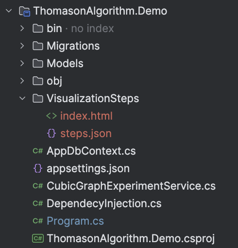
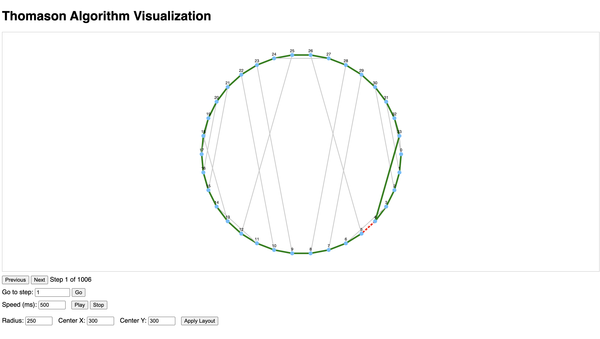

# Graph Visualization Example

**Purpose**:  
Demonstrates how to generate step-by-step visualizations of the Lollipop Algorithm's execution on a predefined cubic graph.

## 1. Visualization Method

### Core Implementation
```csharp
public class CubicGraphExperimentService
{ 
    public void CreateLollipopStepsVisualization(string graphString)
    {
        // Convert input string to adjacency matrix
        var adjacencyMatrix = GetMatrixFromNeighborsString(graphString);
        
        // Initialize graph structures
        var cubicGraph = new CubicGraph(adjacencyMatrix);
        var cubicGraphWithCycle = new CubicGraphWithCycle(cubicGraph);
        
        // Generate visualization
        LollipopAlgorithm.CreateLollipopVisualization(cubicGraphWithCycle);
    }
}
```

### 2. Input Format
The method accepts graphs in a specific string format:
```csharp
"1,33,32_0,2,31_1,3,30_..._31,33,0_32,0,4"
```
- Each X,Y,Z segment represents a vertex's neighbors

- Segments are separated by underscores (_)

- Vertex numbering starts at 0

### 3. Result
After executing the visualization method, the system generates all necessary files in the `VisualizationSteps` directory in the root of calling project \


To view the algorithm visualization find the `index.html` and launch it 
